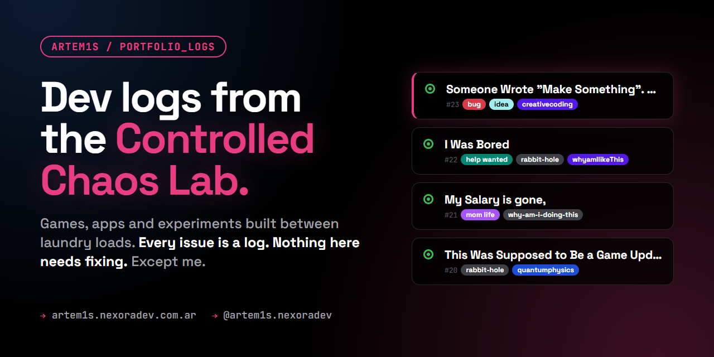

  

  
  
  

# portfolio_logs

The public dev diary behind **[The Controlled Chaos Lab](https://artem1s.nexoradev.com.ar/?utm_source=github&utm_medium=readme&utm_campaign=portfolio_logs)**: games, apps and experiments I build in the gaps between work, school runs and laundry.

There is no code here. The code lives in the projects. This repo holds the story of how each one happened: the idea, the rabbit hole, the part that broke, and the part I shipped anyway.

## How it works

| On GitHub | What it actually is |
| --- | --- |
| **Issue** | A dev log entry. One idea, one project, one bad decision. |
| **Comment** (by me) | A follow-up on the same log: updates, fixes, regrets. |
| **Label** | The mood. `bug` is rarely a bug. `help wanted` is never a job posting. |
| **Open** | Every log stays open. Nothing here is "resolved". Neither am I. |

The logs are pulled live into the **Logs** section of my site, so they're also readable without a GitHub account.

## Latest logs

| # | Log | Mood |
| --- | --- | --- |
| [#23](https://github.com/Artem1s/portfolio_logs/issues/23) | Someone Wrote "Make Something". So I Did | `bug` `idea` |
| [#22](https://github.com/Artem1s/portfolio_logs/issues/22) | I Was Bored | `help wanted` `rabbit-hole` |
| [#21](https://github.com/Artem1s/portfolio_logs/issues/21) | My Salary is gone, | `mom life` `why-am-i-doing-this` |
| [#20](https://github.com/Artem1s/portfolio_logs/issues/20) | This Was Supposed to Be a Game Update | `rabbit-hole` `quantumphysics` |
| [#19](https://github.com/Artem1s/portfolio_logs/issues/19) | Rastro, a work in progress, emphasis on work, even more on progress. | `game-design` |

→ [All logs](https://github.com/Artem1s/portfolio_logs/issues?q=is%3Aissue)

## Things that came out of these logs

| Project | What it is |
| --- | --- |
| [**Something**](https://artem1s.nexoradev.com.ar/games/something/index.html) | Ask for anything. A split-flap board pretends to think, then delivers something technically correct. |
| [**Claros**](https://artem1s.nexoradev.com.ar/games/claros/index.html) | A logic puzzle with a fox, firefly jars and consequences. |
| [**Rastro**](https://artem1s.nexoradev.com.ar/games/rastro/index.html) | Real-time online game: your box paints the floor, everyone else wants you gone. 2D and 3D. |
| [**Trazo**](https://artem1s.nexoradev.com.ar/games/trazo/index.html) | Sokoban with wet paint. Then bridges, gates and holes. On purpose. |
| [**Leakit**](https://artem1s.nexoradev.com.ar/games/leakit/index.html) | An expense tracker that watches your salary leave, with commentary and Telegram alerts. |
| [**Loopit**](https://artem1s.nexoradev.com.ar/games/loopit/index.html) | A chores app where the clock starts when you do the thing, not when a calendar decided you should. |

Everything else is on the [site](https://artem1s.nexoradev.com.ar/?utm_source=github&utm_medium=readme&utm_campaign=portfolio_logs).

## Stack, roughly

Plain HTML, CSS and JavaScript for most games · Three.js for the 3D ones · Next.js for the site · Node for the tooling · AI as one more tool in the box, never the one deciding.

## Contributing

New issues are limited to collaborators, because every issue is a log I write.
Comments are open. Humans are welcome to read, react and say hi.

Bots: we've met. See [#22](https://github.com/Artem1s/portfolio_logs/issues/22). Your fix was very convincing for a file that doesn't exist.

---

  Made by <a href="https://github.com/Artem1s">Artem1s</a> · <a href="https://artem1s.nexoradev.com.ar/?utm_source=github&utm_medium=readme&utm_campaign=portfolio_logs">artem1s.nexoradev.com.ar</a> · <a href="https://www.instagram.com/artem1s.nexoradev/">@artem1s.nexoradev</a>

